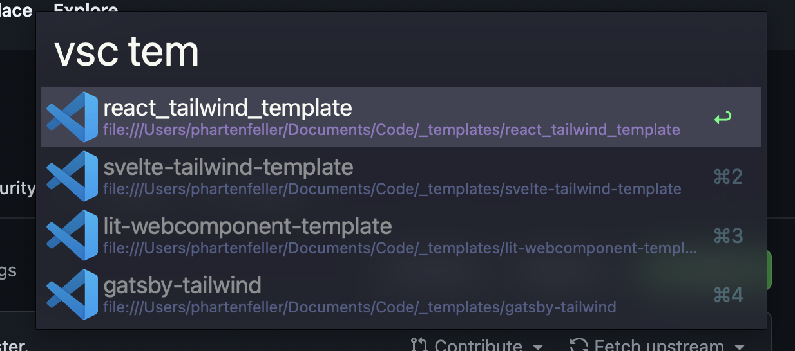

# Alfred 4/5 Workflow for VSCode Workspaces

Get a list of your VS Code workspaces in alfred

- Type `vsc` into alfred to get a list
- Works with **local** and **remote** workspaces



Forked from https://github.com/kbshl/alfred-vscode

Blogpost: https://hartenfeller.dev/blog/alfred-vscode-workflow

## Installation

You need `code` added to shell path: https://code.visualstudio.com/docs/setup/mac#_launching-from-the-command-line

You need a [currently maintained Node.js version](https://nodejs.org/en/about/previous-releases).

```bash
npm install --global @phartenfeller/alfred-vscode-workspaces
```
